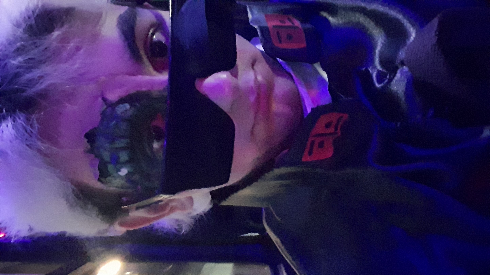

# Programación con objetos I
## Presentación Personal

### Datos Personales
¡Hola! Mi nombre es Franco Gabriel Rojas y vivo en la zona de Haedo. Actualmente, estoy cursando el tercer cuatrimestre de la Tecnicatura en Programación en la Universidad Nacional de Hurlingham (UNAHUR), a la que ingresé en 2024. Elegí estudiar en esta universidad porque varios familiares, amigos, conocidos y docentes de la escuela secundaria me la recomendaron, destacando su variedad de carreras y su buen nivel en el área de tecnología e informática.

Trabajo en la empresa Sistemas Energéticos S.A., una pyme dedicada a la instalación y mantenimiento de grupos electrógenos, tableros eléctricos, shelters con equipamiento completo, paneles solares y servicio técnico de los productos que ofrecemos. La empresa está especializada en brindar soluciones para zonas con poco o nulo acceso a la red eléctrica. Comencé en 2023 como practicante a través de mi escuela secundaria y, tras completar mi año de práctica, me ofrecieron un puesto fijo como ayudante de laboratorio y taller.

Estudié en la Escuela Técnica N°8 de Morón, donde me gradué en 2023 como Técnico en Electrónica. Aunque la programación no fue un área muy desarrollada en mi formación secundaria, lo poco que vimos despertó mi interés y me motivó a seguir explorando este mundo. Dentro de la informática, hay muchas áreas que me resultan fascinantes, y una de ellas es la Inteligencia Artificial, un campo en el que me gustaría experimentar en el futuro.

Esta foto soy yo disfrazado para una fiesta de disfraces. Me vestí como un Visitante de la serie de los 80s Invasión V. Me encanta lo retro y lo vintage, tanto en películas y series como en la moda y los estilos de aquella época.
